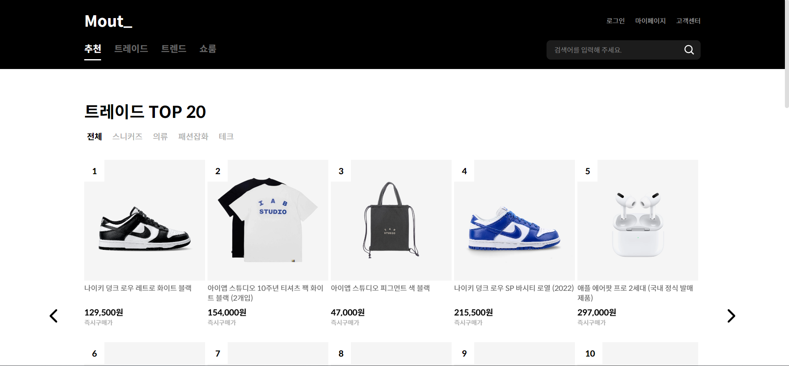
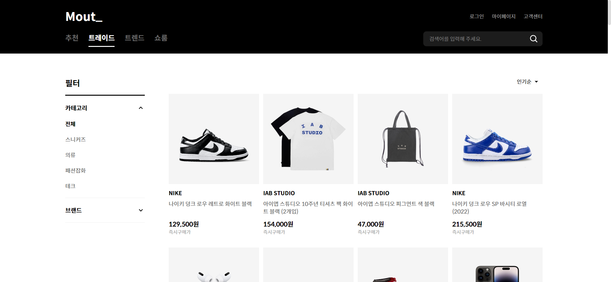
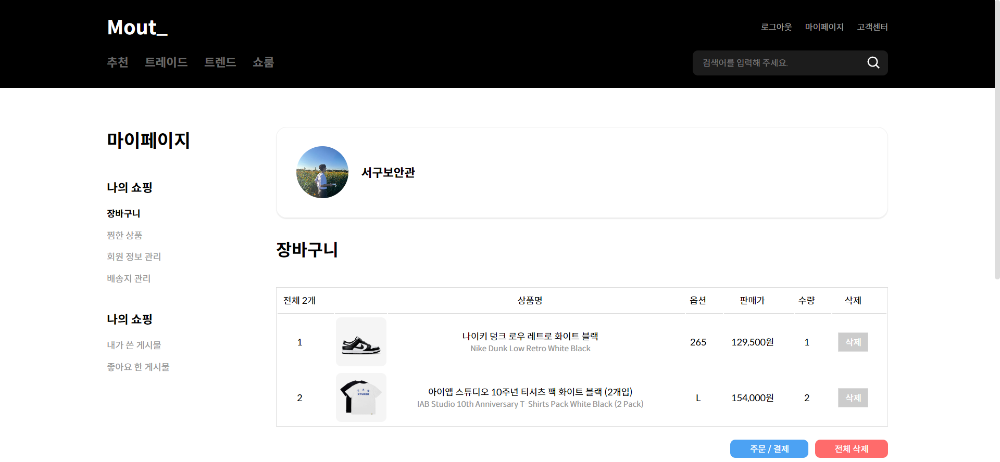
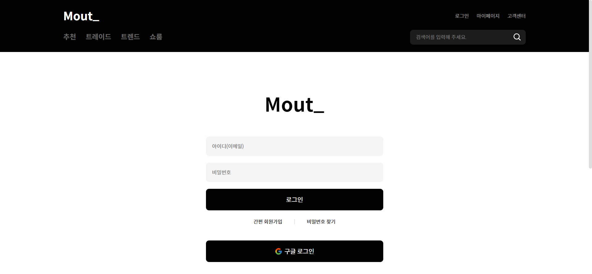
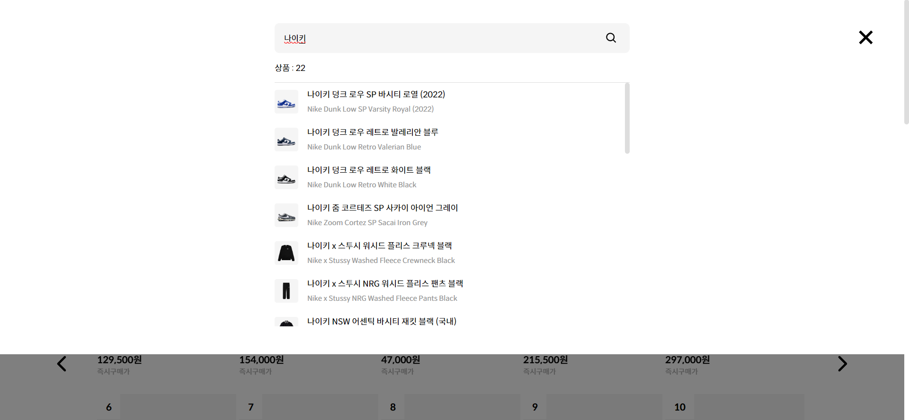
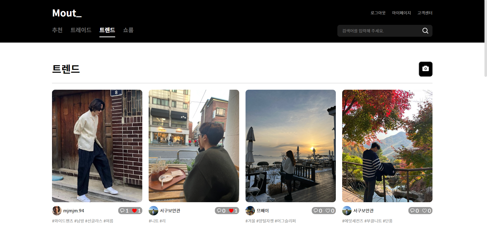
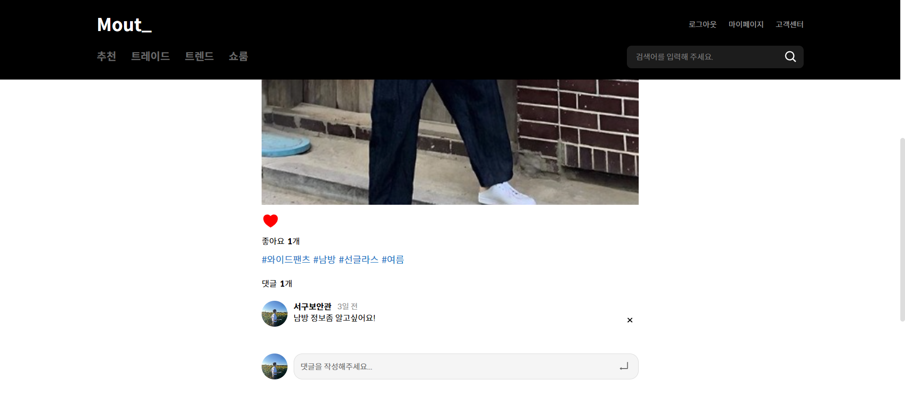

# Mout\_\_

---

### 🥼 쇼핑몰 및 스타일 공유 커뮤니티 웹 서비스

- 옷에 관심이 많아 의류 쇼핑몰인 솔드아웃과 크림 서비스를 클론 코딩하였고, 스타일 공유 커뮤니티를 추가해 옷에 관심이 많은 사람들끼리 각자의 스타일을 공유할 수 있는 서비스입니다.
- ### [배포 링크](https://mout-vercel.vercel.app/)

---

### 💿 주요 기술

- React
- TypeScript
- Emotion
- React-Query
- Axios
- Firebase Auth : 로그인 및 회원가입, 유저 정보
- Firestore Database : 유저 정보 (장바구니, 제품 좋아요, 게시물 좋아요 등), 게시물 데이터베이스
- Kakao Map API

### 💿 주요 기능

- 메인 페이지 : 카테고리 별 가장 판매량이 많은 제품을 슬라이드 형식으로 확인
  

- 카테고리 별 필터링을 통한 제품 분류 / 선택 기준에 따른 제품 정렬
  

- 제품 상세페이지 내 좋아요 버튼 / 장바구니 버튼을 통해 유저 데이터베이스에 저장
  

- 마이페이지 내에서 장바구니에 담긴 제품 수량 / 리스트 확인 가능
  

- 로그인 / 회원가입

  - 이메일 또는 구글 계정으로 회원가입 시 유저 데이터베이스에 회원 정보 저장
  - 유저 기본 정보 이외에 프로필 이미지, 닉네임, 배송지, 장바구니, 제품/게시물 좋아요, 작성 게시물 등을 유저 데이터베이스 내에 추가
    

- 검색창 자동완성

  - 검색어 입력 시 디바운스 훅을 통한 API 호출 최소화로 성능 최적화
  - 키워드가 포함되어 있는 제품 리스트 나열
    

- 회원 스타일 공유 커뮤니티

  - 이미지와 해시태그를 통해 스타일을 공유
  - 여러 회원들의 스타일 공유 게시물 확인 및 좋아요 / 댓글 작성
    
    

- 마이페이지
  - 마이페이지 내에서 유저 활동 요약 정보 확인
  - 프로필 이미지 / 닉네임 변경
  - 회원 기본 정보 확인
  - 장바구니 / 좋아요한 제품 확인
  - 배송지 관리
  - 커뮤니티 내가 작성한 게시물 / 좋아요한 게시물 확인
    
